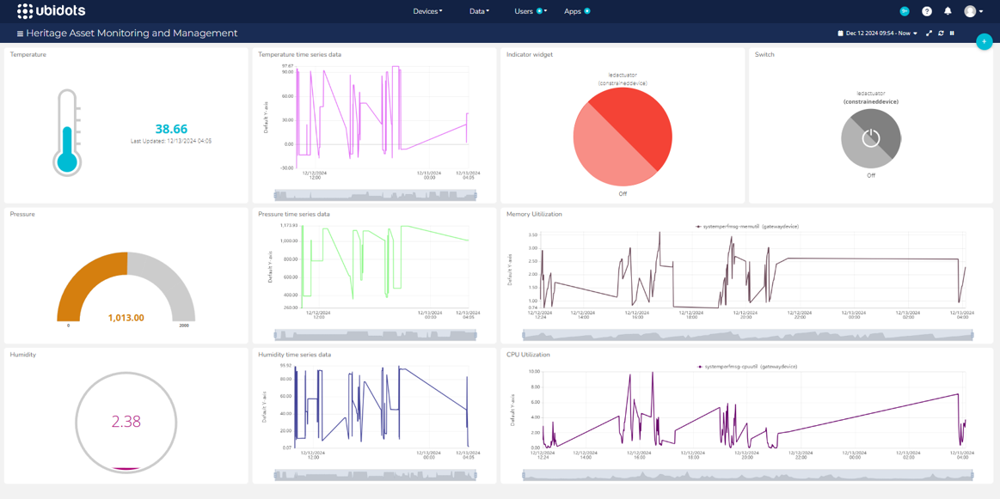

# Heritage-Asset-Monitoring-and-Management-System

## Description

The objective is to ensure the preservation and protection of valuable heritage assets, such as artifacts and historical items, by monitoring and adjusting environmental conditions in real time. The system features continuous 24/7 monitoring of temperature, humidity, and pressure to safeguard these assets. Proactive adjustments are automatically made to maintain optimal environmental conditions, reducing the risk of deterioration. Additionally, the system incorporates an alert mechanism that sends notifications or triggers actuators when environmental parameters exceed safe limits. This approach effectively prevents damage and ensures the long-term preservation of heritage artifacts.

## What - The Problem 

Heritage assets, such as artifacts, artworks, manuscripts, and sculptures, are highly sensitive to environmental changes, making them vulnerable to damage. Fluctuating temperature, humidity, and atmospheric pressure can lead to irreversible deterioration, including cracking of paintings, warping of wooden items, and mold growth on textiles. Despite these risks, many museums and galleries still rely on outdated or manual methods to monitor environmental conditions, which are inefficient and prone to errors. Moreover, existing systems often lack continuous, real-time monitoring and automatic adjustments, leaving valuable artifacts inadequately protected against environmental threats.

## Why - Who Cares? 

Curators and conservators are professionals responsible for ensuring the preservation and proper care of artifacts and collections. Museums, libraries, and galleries serve as custodians of valuable historical artifacts and require reliable environmental control systems to maintain their integrity. Additionally, private collectors, whether individuals or organizations, who possess rare or valuable artifacts must safeguard their investments against environmental damage to ensure long-term protection and preservation.

## How - Expected Technical Approach

The outcomes achieved include enhanced preservation of valuable heritage assets such as artifacts, manuscripts, and artworks by protecting them from environmental fluctuations. Real-time monitoring of temperature, humidity, and pressure ensures immediate detection of changes, while proactive adjustments maintain optimal conditions to prevent damage. The system improves efficiency by eliminating manual monitoring methods and reducing human error. Timely alerts, through notifications or actuator triggers, enable quick responses when environmental thresholds are exceeded. This approach ensures the long-term sustainability and longevity of historical and cultural assets, providing increased confidence to museums, galleries, and private collectors that their artifacts are actively monitored and safeguarded.

### System Diagram

## Dashboard

### Simulator

